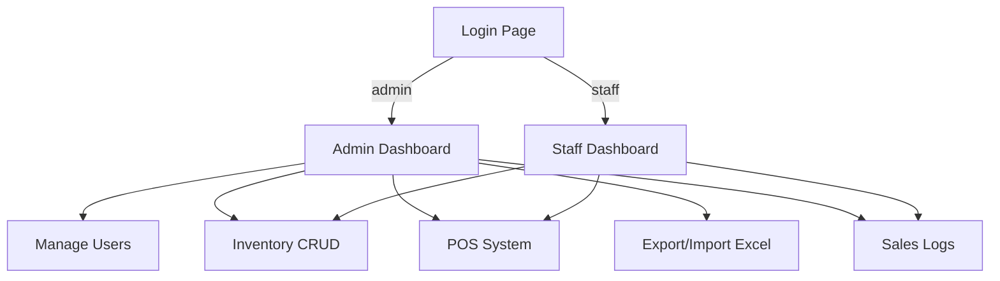

# 🗂️ Inventory Management System (IMS) – PHP Based

## 🔧 Overview
The **Inventory Management System (IMS)** is a modern, web-based application developed entirely in **PHP**, utilizing **MySQL (via XAMPP)** and **Excel integration** for handling inventory and transaction records.

The system supports **full CRUD operations** (Create, Read, Update, Delete) and incorporates a simple yet powerful **Point of Sale (POS)** module for processing sales directly within the system.

---

## 🎯 Features

### 👤 User Authentication
- **Admin Login**
  - **Username:** `admin`
  - **Password:** `admin`
- Admin can **create additional user accounts** with:
  - **Admin Role** (full access)
  - **Staff Role** (limited access)

### 📦 Inventory Module
- ✅ Add, Edit, Delete, View items
- 📊 Inventory quantity tracking
- ⏳ Low-stock alerts
- 🏷️ Category tagging
- 🖼️ Product images

### 🧾 Point of Sale (POS)
- 💰 Barcode/Item ID scanning
- 🛒 Cart system for transaction processing
- 🧍 Assign staff to transactions
- 🖨️ Printable receipts
- 🔄 Live stock deduction on sale

### 📑 Reports & Logging
- 📥 Export inventory data to **Excel**
- 📤 Import from Excel (bulk upload)
- 📜 Sales history with filters
- 🔎 Searchable logs (by date, product, staff)

---

## 🛠️ Technology Stack

| Layer        | Tools/Tech                          |
|--------------|-------------------------------------|
| Frontend     | HTML5, CSS3, JavaScript             |
| Backend      | PHP (Procedural or OOP)             |
| Database     | MySQL (via XAMPP)                   |
| Reporting    | Excel (CSV Import/Export)           |
| Design       | Responsive, Minimal UI (Bootstrap)  |

---

## 🖥️ System Design (Visual Diagram)



---

## 🔐 Roles & Permissions

| Role   | Manage Users | Inventory | POS | Reports |
|--------|--------------|-----------|-----|---------|
| Admin  | ✅           | ✅        | ✅  | ✅      |
| Staff  | ❌           | ✅        | ✅  | ✅      |

---

## 📂 Folder Structure

```
inventory-system/
│
├── config/               # DB connection, config files
├── assets/               # CSS, JS, images
├── includes/             # Reusable PHP includes
├── pages/                # Dashboard, POS, Inventory, etc.
├── uploads/              # Product images
├── exports/              # Excel reports
├── index.php             # Entry point
└── login.php             # Authentication
```

---

## 📋 Future Improvements (Optional Ideas)
- 📱 Mobile-Responsive Design
- 🌐 Role-based API (for external apps)
- 📦 Supplier & Purchase Order Module
- 🔒 2FA for admin logins
- 📈 Dashboard analytics

---

## 🧪 Testing Accounts

| Username | Password | Role  |
|----------|----------|-------|
| admin    | admin    | Admin |

---

## 📁 Database & Excel Compatibility

- **MySQL Support**
  - Structured schema with relations (users, inventory, sales, logs)
- **Excel Logging**
  - Export: `.csv`, `.xls`, `.xlsx`
  - Import: Use format template provided

---

> ⚠️ **Security Note**: Please change the default `admin` password in a production environment.

---